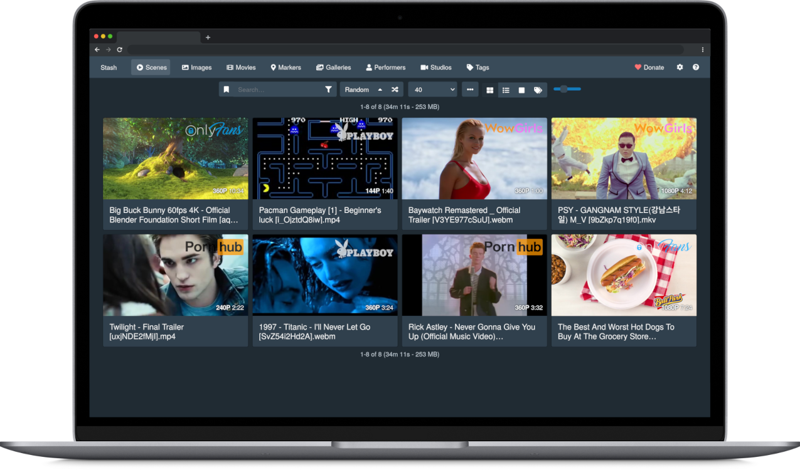

# stash for Home Assistant Community Add-ons

<h3>Stash is a self-hosted webapp written in Go which organizes and serves your diverse content collection, catering to both your SFW and NSFW needs.</h3>

- Stash gathers information about videos in your collection from the internet, and is extensible through the use of community-built plugins for a large number of content producers and sites.
- Stash supports a wide variety of both video and image formats.
- You can tag videos and find them later.
- Stash provides statistics about performers, tags, studios and more.

You can [watch a SFW demo video](https://vimeo.com/545323354) to see it in action.
